# TCP
## TCP 3 way handshake 
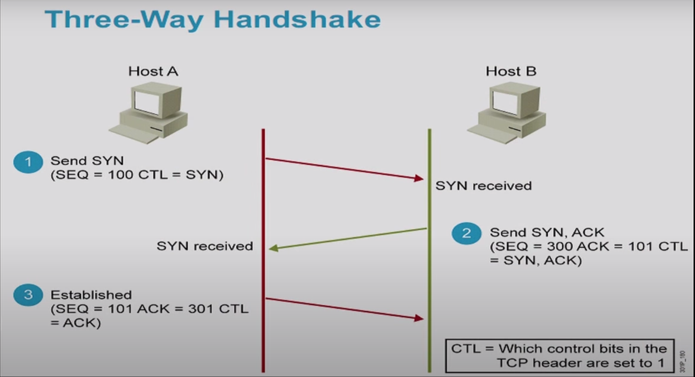
## TCP flow control
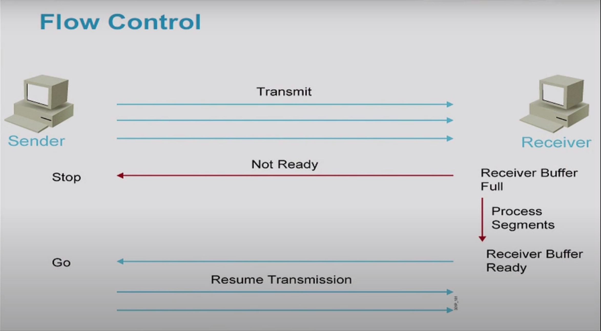
## TCP data handshake, data transfer and closing connection
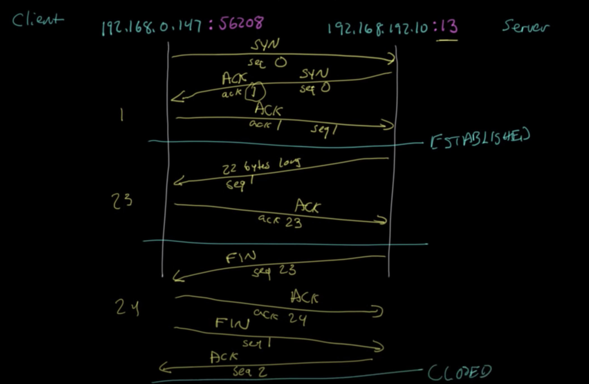
# HTTP
- A higher layer protocol which sends data to TCP
# Web Socket
## Why?
- Need something for real time collaboration
- low latency
- 2 way push
- browser to server
## Details
- Websocket is inside the TCP socket
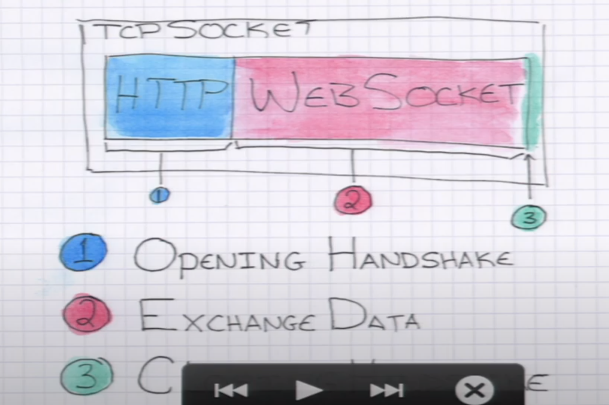
- After http handshake, it use `101` i.e. switching protocol 
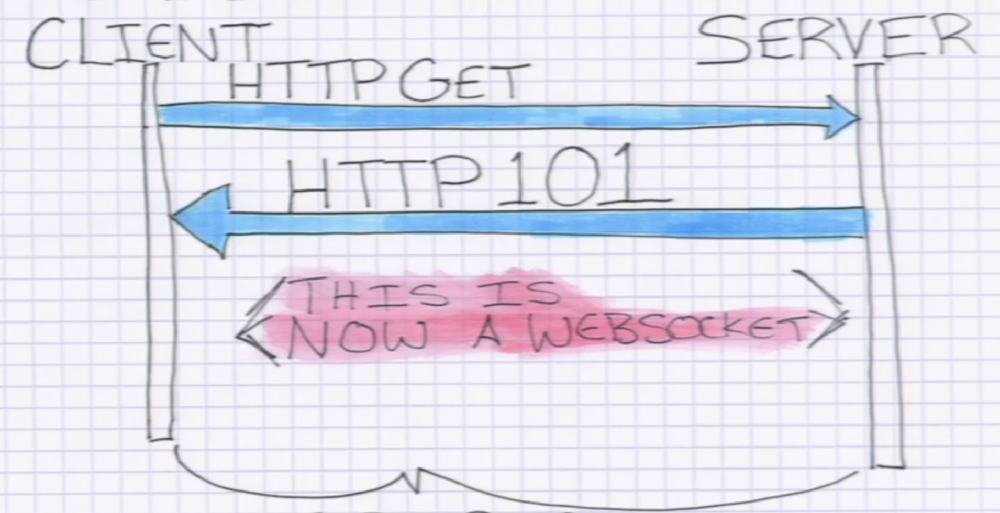
    - Websocket was first to use `101`
    - After that same TCP connection turns into websocket
    - It also exchanges protocol version, sub protocol version, extension etc
    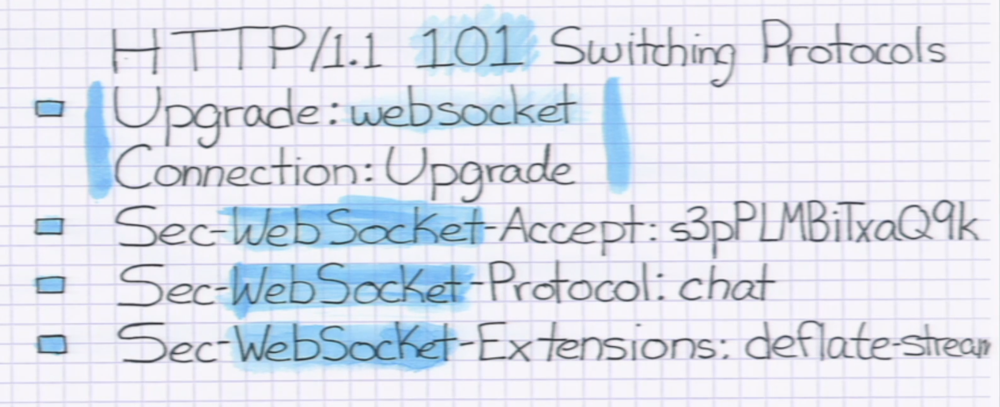
- Key accepts
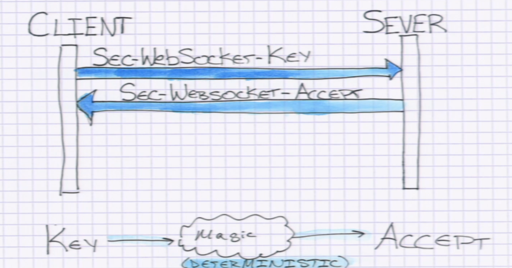
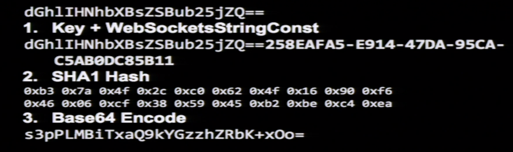
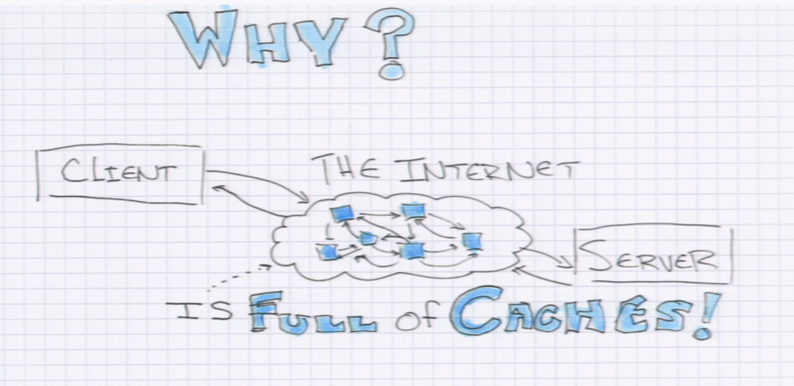
- Version negotiations
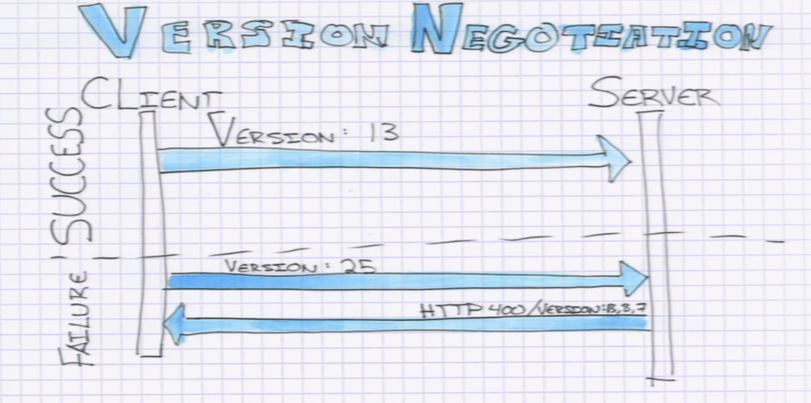
- Sub protocol negotiations
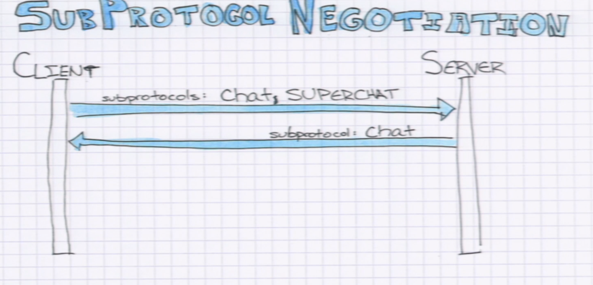
- Data exchange
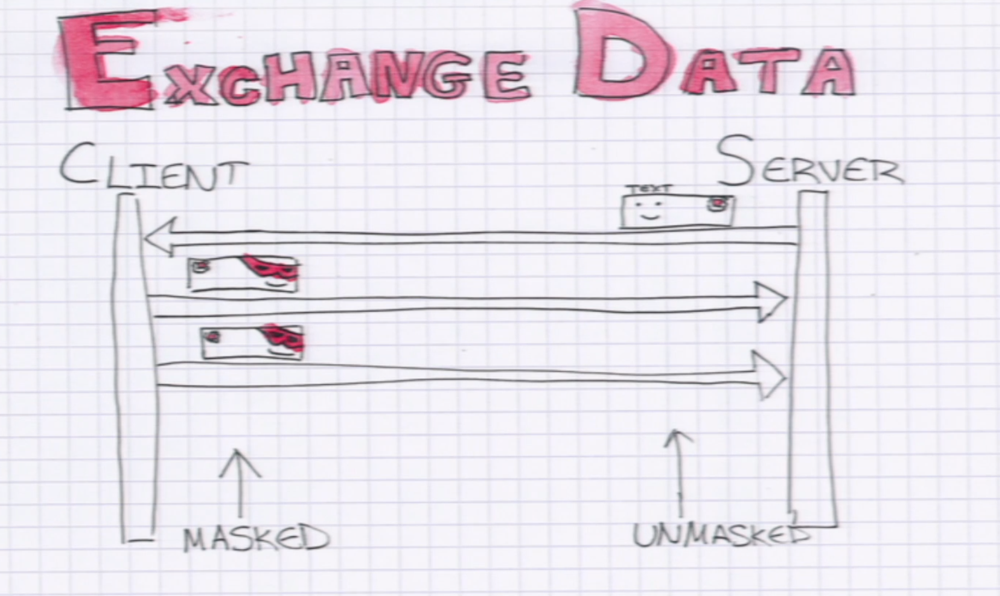
    - Web socket is message based
    - Use javascript interface
    - Server can send message
    - Client can send message
    - Client message is always mask
    - Server message is never masked
    - It can sends binary/text data
    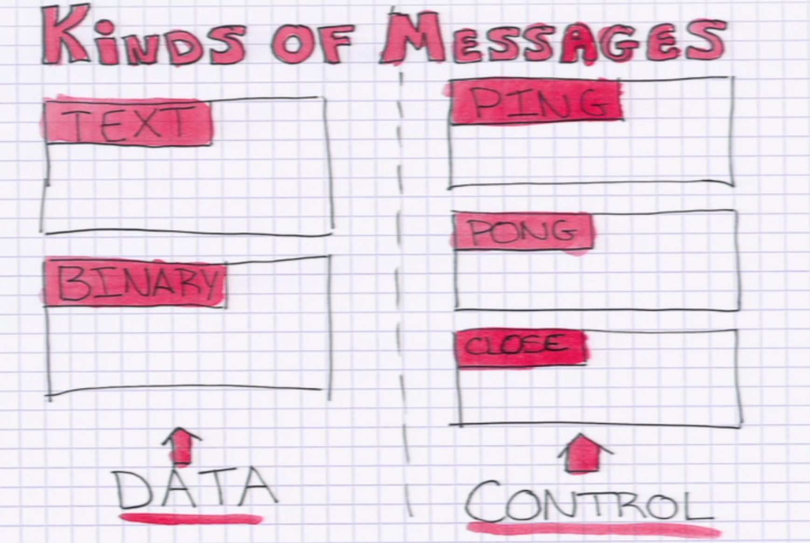
    - Data is send as series of frames
    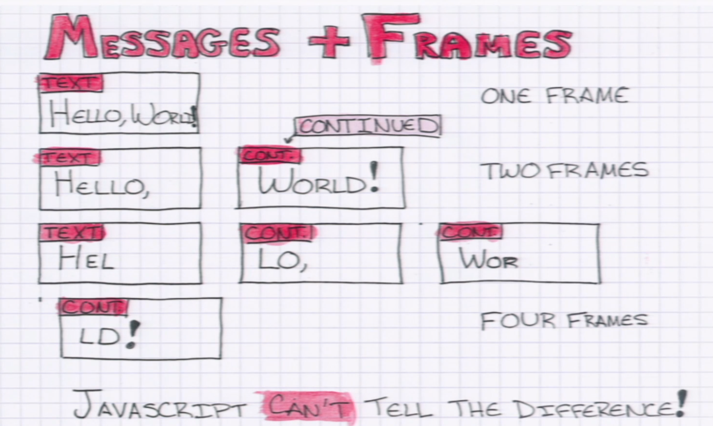
    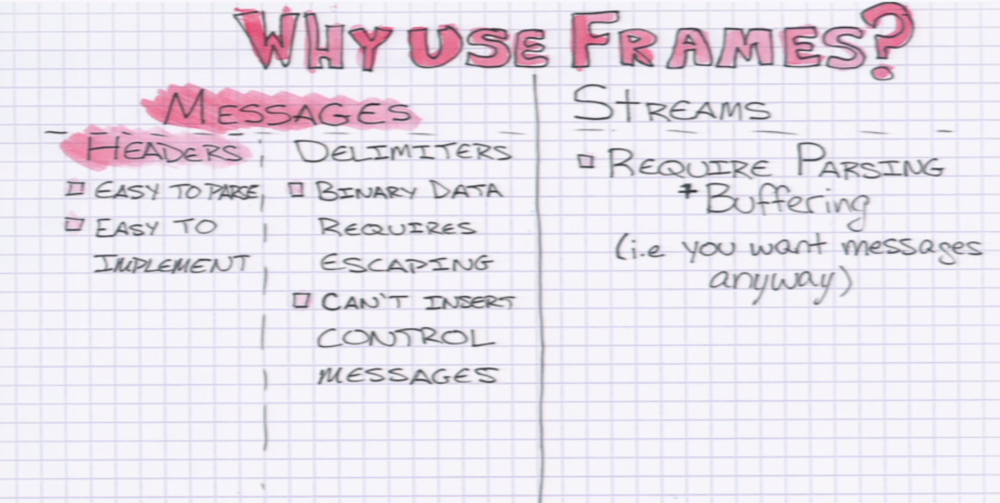
 ## Node.js example
 ### Communication between client and server
 - How can we connect two clients for bidirectional messaging?
 - You have to do some routing in your server app which will act as brokers for two client. 
 - You can't always connect to two clients bcz they don't have always public accessible IP
 - Your server app will always have public ip
 - That's why server app is necessary if you want to implement peer to peer bidirectional 
 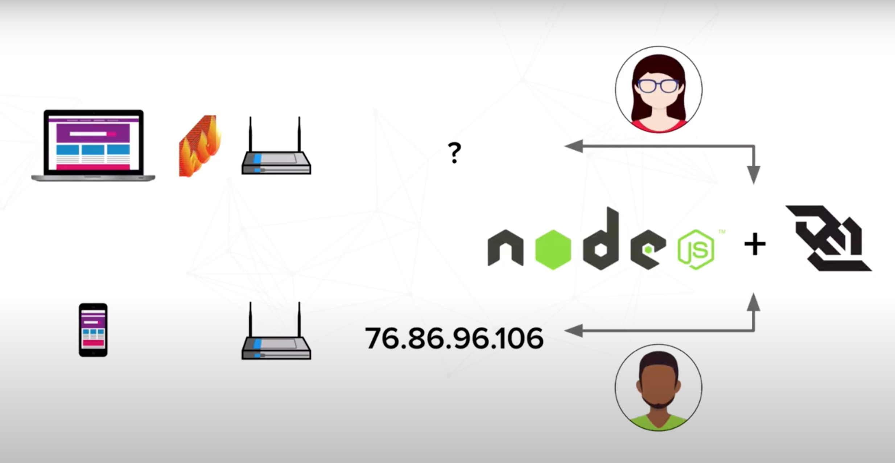
 ### Communication between browser and server
 - socket programming in browser is bit complicated, but websocket is not
 - In browser, we can natively use the websocket protocol
### Communication between client to client 
- You can use pubnub service
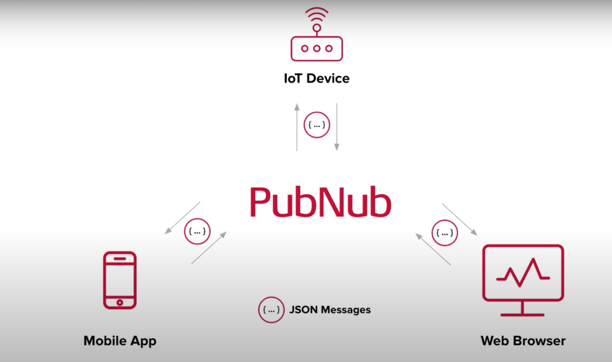

# Reference 
https://www.youtube.com/watch?v=YaJbc7s1ROg
https://www.youtube.com/watch?v=9FqjRN4VYUU
